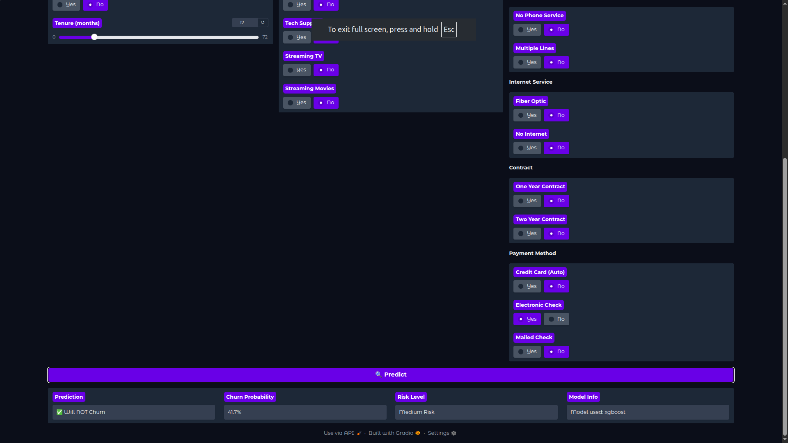
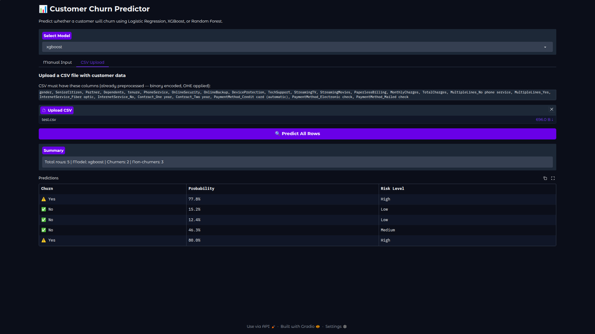

# Customer Churn Prediction — End-to-End ML Pipeline on GCP

Predicts whether a telecom customer will churn using Logistic Regression, Random Forest, and XGBoost — deployed on Google Cloud Platform with a FastAPI backend and Gradio frontend.


---

## How It Works

The user opens the Gradio frontend, selects a model from the dropdown, and either manually enters customer details or uploads a CSV file. The frontend sends the data to the FastAPI backend, which loads the trained model from Google Cloud Storage and returns the prediction — whether the customer will churn, the probability, and the risk level (Low / Medium / High).

---

## Project Structure

```
├── data_extraction.py      # reads raw CSV, cleans data, outputs preprocessed CSV
├── train.py                # trains all 3 models, saves to models/ and uploads to GCS
├── main.py                 # FastAPI backend — loads models from GCS, serves predictions
├── gradio_app.py           # Gradio frontend — manual input and CSV upload
├── requirements.txt
└── README.md
```

---

## Dataset

**IBM Telco Customer Churn** — 7,043 customers, 20 features including demographics, services, contract type, billing info, and whether the customer churned.

Raw dataset: `WA_Fn-UseC_-Telco-Customer-Churn.csv`

**Preprocessing steps in `data_extraction.py`:**
- Dropped `customerID` — no predictive value
- Fixed `TotalCharges` — was stored as string, coerced to float, filled missing with 0
- Encoded binary Yes/No columns using `.map({'Yes': 1, 'No': 0})`
- Encoded `gender` as binary
- Applied One-Hot Encoding on multi-class columns (`InternetService`, `Contract`, `PaymentMethod`, `MultipleLines`) with `drop_first=True` to avoid multicollinearity
- Applied SMOTE to fix class imbalance before training

---

## Models

Trained and compared 3 models:

| Model | Accuracy | Churn Recall | F1 (Churn) |
|---|---|---|---|
| Logistic Regression | 75.6% | 83% | 0.64 |
| Random Forest | 78.1% | 59% | 0.59 |
| XGBoost | 75.5% | 82% | 0.64 |

**Why churn recall matters more than accuracy:**
Raw accuracy is misleading on imbalanced datasets. The goal is catching customers who are about to leave — missing them is the worst outcome. Logistic Regression and XGBoost both hit 82–83% recall on churners, meaning they catch 4 out of 5 at-risk customers. Random Forest had the best accuracy but missed 41% of churners — the worst tradeoff for this problem.

**Top features driving churn (Logistic Regression coefficients):**


| Feature | Coefficient |
|---|---|
| TotalCharges | 0.997 |
| InternetService_Fiber optic | 0.802 |
| StreamingMovies | 0.322 |
| StreamingTV | 0.258 |
| PaperlessBilling | 0.203 |

Customers on Fiber Optic with high total charges and month-to-month contracts are the highest risk segment.

---

## GCP Architecture


```
Raw CSV
   │
   ▼
data_extraction.py ──► Telo_Customer_Dataset_LR.csv
   │
   ▼
train.py (runs on Compute Engine VM)
   │
   ▼
Google Cloud Storage (models/scaler.pkl, models/xgboost.pkl ...)
   │
   ▼
main.py — FastAPI (loads models from GCS on startup)
   │
   ▼
gradio_app.py — Gradio frontend (calls FastAPI via HTTP)
```

---

## Run Locally

**1. Clone the repo**
```bash
git clone https://github.com/yourusername/churn-prediction.git
cd churn-prediction
```

**2. Install dependencies**
```bash
pip install -r requirements.txt
```

**3. Authenticate with GCP**
```bash
gcloud auth application-default login
```

**4. Update bucket name**

In `main.py` change:
```python
BUCKET_NAME = "your-bucket-name"
```
**5. Run Data Extraction
```python
python data_extraction.py
```
**6. Run train.py -> Train the models
```python
python train.py
```

**7. Run FastAPI**
```bash
uvicorn main:app --reload --port 8000
```

**8. Run Gradio (new terminal)**
```bash
python gradio_app.py
```

- FastAPI: `http://localhost:8000`
- FastAPI docs: `http://localhost:8000/docs`
- Gradio UI: `http://localhost:7860`

---

## Deploy on GCP Compute Engine

**1. Create VM**
```bash
gcloud compute instances create churn-training-vm \
  --zone=us-central1-a \
  --machine-type=e2-medium \
  --image-family=ubuntu-2004-lts \
  --image-project=ubuntu-os-cloud \
  --boot-disk-size=20GB \
  --scopes=https://www.googleapis.com/auth/cloud-platform
```

**2. Open firewall ports**
```bash
gcloud compute firewall-rules create allow-churn-api \
  --allow tcp:8000 --source-ranges 0.0.0.0/0

gcloud compute firewall-rules create allow-gradio \
  --allow tcp:7860 --source-ranges 0.0.0.0/0
```

**3. SSH into VM and run**
```bash
gcloud compute ssh churn-training-vm --zone=us-central1-a

pip3 install -r requirements.txt
uvicorn main:app --host 0.0.0.0 --port 8000 &
python3 gradio_app.py
```

---

## API Endpoints

### `POST /predict/manual`
Send a single customer's features as JSON:
```json
{
    "model_name": "xgboost",
    "gender": 1,
    "SeniorCitizen": 0,
    "Partner": 1,
    "Dependents": 0,
    "tenure": 12,
    "PhoneService": 1,
    "OnlineSecurity": 0,
    "OnlineBackup": 0,
    "DeviceProtection": 0,
    "TechSupport": 0,
    "StreamingTV": 0,
    "StreamingMovies": 0,
    "PaperlessBilling": 1,
    "MonthlyCharges": 65.5,
    "TotalCharges": 786.0,
    "MultipleLines_No_phone_service": 0,
    "MultipleLines_Yes": 0,
    "InternetService_Fiber_optic": 1,
    "InternetService_No": 0,
    "Contract_One_year": 0,
    "Contract_Two_year": 0,
    "PaymentMethod_Credit_card_automatic": 0,
    "PaymentMethod_Electronic_check": 1,
    "PaymentMethod_Mailed_check": 0
}
```

Response:
```json
{
    "model_used": "xgboost",
    "prediction": {
        "churn": true,
        "churn_probability": 0.821,
        "risk_level": "High"
    }
}
```

### `POST /predict/csv`
Upload a preprocessed CSV file with multiple customers:
```
POST /predict/csv?model_name=xgboost
Content-Type: multipart/form-data
file: test_customers.csv
```

Response:
```json
{
    "model_used": "xgboost",
    "total_rows": 5,
    "predictions": [
        { "churn": true,  "churn_probability": 0.821, "risk_level": "High"   },
        { "churn": false, "churn_probability": 0.231, "risk_level": "Low"    },
        { "churn": false, "churn_probability": 0.134, "risk_level": "Low"    },
        { "churn": true,  "churn_probability": 0.612, "risk_level": "Medium" },
        { "churn": true,  "churn_probability": 0.743, "risk_level": "High"   }
    ]
}
```

---

## Screenshots





---

## Tech Stack

- **ML:** scikit-learn, XGBoost, imbalanced-learn (SMOTE)
- **Backend:** FastAPI, Uvicorn
- **Frontend:** Gradio
- **Cloud:** Google Cloud Platform — Compute Engine, Cloud Storage
- **Other:** joblib, pandas, numpy